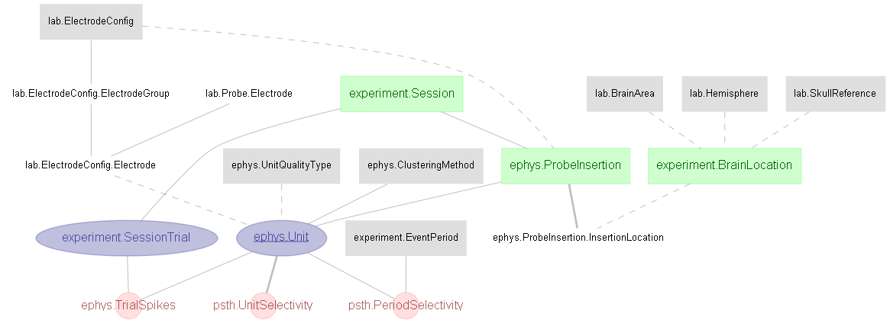

# Li et al., 2015 and Li, Daie et al., 2016
DataJoint-NWB conversion project for Li et al. (2015) and Li, Daie et al. (2016) papers.
 
This project presents a DataJoint pipeline design for the data accompanying the following papers:

>Nuo Li, Tsai-Wen Chen, Zengcai V. Guo, Charles R. Gerfen & Karel Svoboda. "A motor cortex circuit for motor planning and movement" (2015) Nature (https://dx.doi.org/10.1038/nature14178)

Data available at: https://crcns.org/data-sets/motor-cortex/alm-1

>Nuo Li, Kayvon Daie, Karel Svoboda & Shaul Druckmann. "Robust neuronal dynamics in premotor cortex during motor planning" (2016) Nature (https://dx.doi.org/10.1038/nature17643)

Data available at: https://crcns.org/data-sets/motor-cortex/alm-3

## About the data
Data consists of extracellular recording at the anterior lateral motor cortex (ALM). 
The recordings were performed on mice performing tactile discrimination task with and without photoinhibition. 
Photostimulation was induced during different parts of the task (e.g. sample, delay, response), with varying durations, and at contra, ipsi, or bilateral ALM.  

## Design DataJoint data pipeline 
This repository contains the **Python 3.7** code of the DataJoint data pipeline design for this dataset, as well as scripts for data ingestions and visualization

## Conversion to NWB 2.0
This repository contains the **Python 3.7** code to convert the DataJoint pipeline into NWB 2.0 format (See https://neurodatawithoutborders.github.io/)
Each NWB file represents one recording session. The conversion script can be found [here](scripts/datajoint_to_nwb.py)

## Demonstration of the data pipeline
Data queries and usages are demonstrated in the Jupyter notebooks: [Li 2015](notebooks/Li-2015-examples.ipynb)
 and [Li-Daie 2016](notebooks/Li-Daie-2016-examples.ipynb), where several figures from the paper are reproduced. 

## Schema Diagram
### Behavior


### Ephys


## Instruction to execute this pipeline

### Download original data 

After cloning this repository, download the original data.
 
The original data folder organization for these two papers are highly similar.
For the original data of any one of these two, once downloaded, you should find a data directory
named `data` containing 2 subfolders: `meta_data` (or `meta_data_files`) and `data_structure`, 
representing the files containing the meta information and the electrophysiology recording, respectively.
 
### Setup "dj_local_conf.json"

`dj_local_conf.json` is a configuration file for DataJoint, which minimally specifies the
 database connection information, as well as several other optional configurations.
 
 Create a new `dj_local_conf.json` at the root of your project directory (where you have this repository cloned),
  with the following format:
 
 ```json
{
    "database.host": "database_hostname",
    "database.user": "your_username_here",
	"database.password": "your_password_here",
    "database.port": 3306,
    "database.reconnect": true,
    "loglevel": "INFO",
    "safemode": true,
    "custom": {
	    "database.prefix": "my_db_prefix"
    }
}
```

Note: make sure to provide the correct database hostname, username and password.

The field `database.prefix` specifies a prefix name, in which all created schema and table names will be prepended with.

If you want build different database for each paper individually, make sure to use different `database.prefix` 
when ingest data from each paper separately.

If you want to put data from two papers under the same database, then use the same `database.prefix`.

### Ingest data into the pipeline

Ingest metadata and ephys data, specify paths to the downloaded `meta_data`, and `data_structure`

On a new terminal, navigate to the root of your project directory, then execute the following commands:

##### Set up initial values
```
python scripts/insert_lookup.py
```

##### Ingest meta data
```
python scripts/ingest_meta_Li_2015.py .../path_to_downloaded_li2015/meta_data
```
or
```
python scripts/ingest_meta_Li_Daie_2016.py .../path_to_downloaded_lidaie2016/meta_data_files
```
##### Ingest electrophysiology data
```
python scripts/ingest_data_Li_2015.py .../path_to_downloaded_li2015/data_structure
```
or
```
python scripts/ingest_data_Li_Daie_2016.py .../path_to_downloaded_lidaie2016/data_structure
```
##### Automatic computation
```
python scripts/populate.py
```

### Mission accomplished!
You now have a functional pipeline up and running, with data fully ingested.
 You can explore the data, starting with the provided demo notebooks.
 
From your project root, launch ***jupyter notebook***:
```
jupyter notebook
```

### Export to NWB 2.0
Data from this DataJoint pipeline can be exported in NWB 2.0 format using this [datajoint_to_nwb.py](pipeline/export/datajoint_to_nwb.py) script. 
To perform this export for all ingested data, specify the export location (e.g. `./data/exported_nwb2.0`), execute this command from the project root:

```
python scripts/datajoint_to_nwb.py ./data/exported_nwb2.0
```


